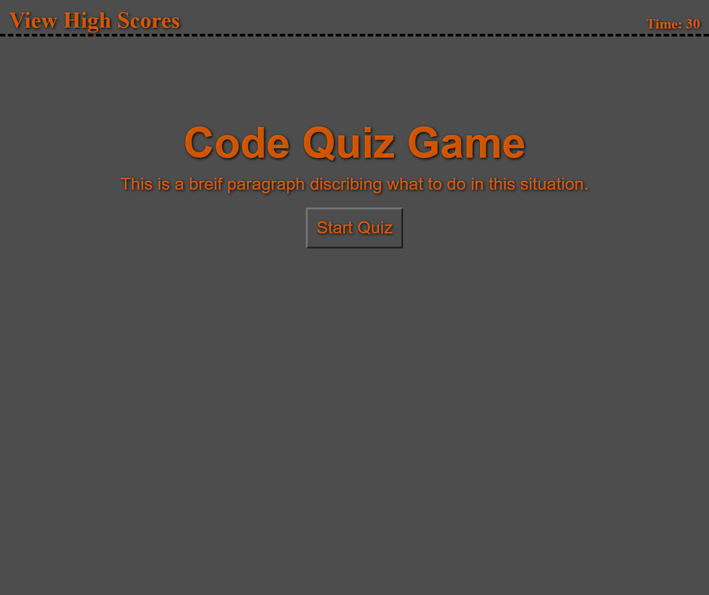
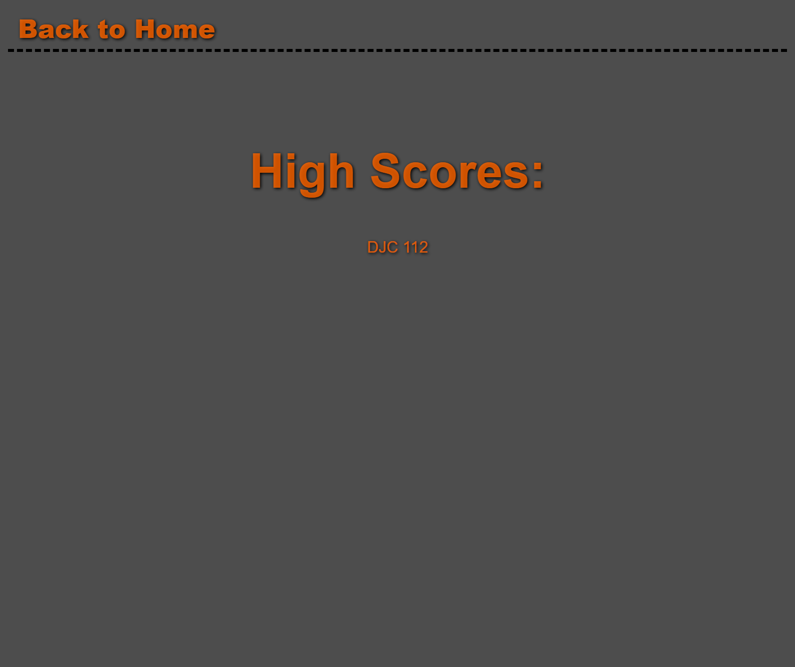

# 04-Web-APIs-Code-Quiz

## Description
This app is a coding quiz, built using web APIs. The User has a set amount of time to complete the quiz and then, their score is calculated and shown to them. They can choose to save their score to the leaderboard or return to the starting point. If they save their score, they can view the leaderboard by clicking a button or restart with another button.

## Link to Deployed App

https://deucedadorian.github.io/04-Web-APIs-Code-Quiz/

## Usage
Click the start button to begin the quiz. Read the question presented and click the answer. If you chose correctly, a point is added to you score. If you chose incorrectly, time is deducted. Once the quiz is over, either by running out of time or answering the last question, an end screen is displayed with the your score. Input you initials where prompted and click the save score button. you can retake the quiz until you are happy with you score and then check the leaderboard to see all of your saved scores!

## Technologies Used

* HTML
* CSS
* JavaScript

## Credits

questions and answers from: 

https://electronicspost.com/multiple-choice-questions-and-answers-on-web-design/

### resets

https://meyerweb.com/eric/tools/css/reset/

https://piccalil.li/blog/a-modern-css-reset

## Screenshots

## License

MIT License

Copyright (c) [2021] [Dylan Cole]
